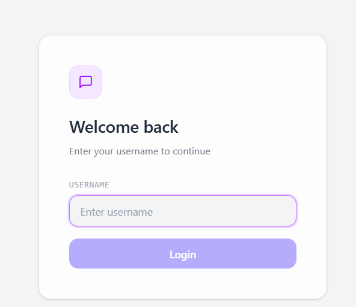
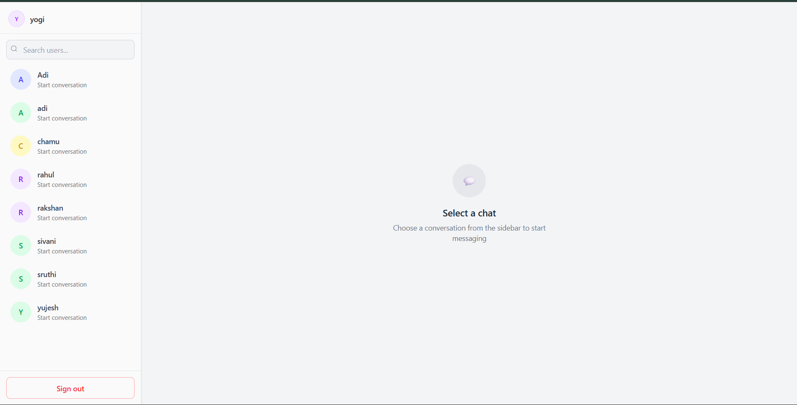
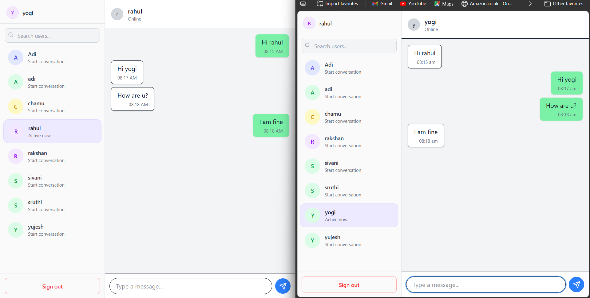

# WhatsApp Web Clone

## Project Overview

This project is a full-stack real-time chat application inspired by WhatsApp Web. It enables users to communicate instantly through a clean and responsive interface.

The application demonstrates real-time communication using Socket.IO, persistent data storage with MongoDB, and a modular frontend architecture using React.

---

## Features

### User Management

* Simple username-based authentication
* Automatic user creation on first login
* Unique user identification using MongoDB `_id`
* User list with search functionality

### Chat Interface

* Two-panel layout (Sidebar + Chat Window)
* Active chat highlighting
* Real-time message display
* Distinct UI for sent and received messages
* Auto-scroll to latest message
* Unread message count per user

### Messaging System

* Send and receive text messages
* Messages stored in MongoDB
* Fetch chat history per user
* Messages displayed in chronological order
* Persistent messages after page refresh
* Each message includes:

  * Sender
  * Receiver
  * Timestamp

### Real-Time Communication

* Instant messaging using Socket.IO
* Live updates without page refresh
* Efficient message broadcasting (no duplicates)

---

## Tech Stack

### Frontend

* React.js
* Tailwind CSS
* Fetch API
* Socket.IO Client

### Backend

* Node.js
* Express.js
* MongoDB (Mongoose)
* Socket.IO

---

## Project Structure

```
project-root/
│
├── client/                 # React Frontend
│   ├── src/
│   │   ├── components/     # UI Components
│   │   ├── pages/          # Page Components
│   │   ├── services/       # API Calls
│   │   ├── socket/         # Socket Setup
│
├── server/                 # Backend
│   ├── controllers/
│   ├── models/
│   ├── routes/
│   ├── socket/
│   ├── config/
│
└── README.md
```

---

## API Endpoints

### Users

* `POST /api/users/login` → Create/Login user
* `GET /api/users` → Get all users

### Messages

* `POST /api/messages` → Send message
* `GET /api/messages/:sender/:receiver` → Get chat history

---

## Installation & Setup

### 1. Clone Repository

```bash
git clone https://github.com/ADISHAR2005/Humble-tree-task.git
cd Humble-tree-task
```

---

### 2. Setup Backend

```bash
cd server
npm install
```

> Note:
> This project does not use environment variables.
> The MongoDB connection string and server port are directly configured in the backend code.

### MongoDB Setup

Make sure MongoDB is running locally:

```text
mongodb://127.0.0.1:27017/whatsapp_clone
```

### Run Backend

```bash
node server.js
```

---

### 3. Setup Frontend

```bash
cd client
npm install
npm run dev
```

---

## Usage

1. Open the application in your browser
2. Enter a username to login
3. Open another browser or incognito window for a second user
4. Start chatting in real-time

---

## How It Works

1. User logs in using a username
2. Backend creates or retrieves the user from MongoDB
3. Users are displayed in the sidebar
4. Selecting a user loads chat history
5. Messages are sent via REST API and stored in MongoDB
6. Socket.IO enables real-time message updates across users

---

## Screenshots

### Chat Interface


### Sidebar & Users

### Messaging View

---


## Author

**Aditya A**

---

## License

This project is for educational purposes.
